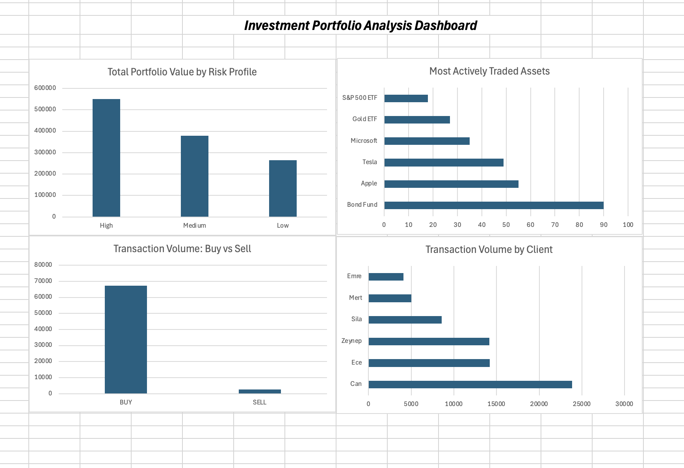

# Investment Portfolio Analysis - SQL Project

## Project Overview

This project analyzes a fictional investment company's portfolio data using SQL.

The aim is to explore customer profiles, portfolio values, asset activity, and transaction behavior through relational database analysis.

## Tools & Technologies

- MySQL
- SQL
- Excel Dashboard
- GitHub

## Database Structure

The database consists of four main tables:

- Clients
- Portfolios
- Assets
- Transactions

Relationships between tables were created using primary keys and foreign keys.

## SQL Analysis

The project includes analysis using:

- SELECT
- WHERE
- ORDER BY
- GROUP BY
- HAVING
- CASE
- COALESCE
- INNER JOIN
- LEFT JOIN
- UNION
- Aggregate functions (COUNT, SUM, AVG, MIN, MAX)

## Key Insights

- High-risk clients had the highest total portfolio value in the dataset.
- Can had the largest portfolio value and the highest transaction volume.
- Bond Fund had the highest traded quantity among assets.
- BUY transaction volume was significantly higher than SELL transaction volume.

## Dashboard

An Excel dashboard was created to visualize:

- Portfolio value by risk profile
- Most actively traded assets
- BUY vs SELL transaction volume
- Transaction volume by client

## Project Files

- database_setup.sql → Database and table creation
- sample_data.sql → Sample investment data
- analysis_queries.sql → SQL analysis queries
- Investment_Portfolio_Dashboard.xlsx → Dashboard visualization

- ## Dashboard Preview

